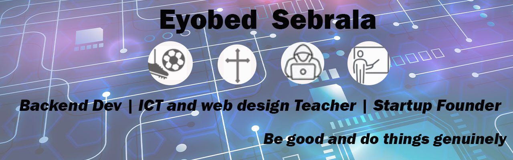

# 👋 Hi there, I'm Eyobed Sebrala!

🎓 **Computer Science Graduate** | 💻 **Backend Developer (Django)** | 🎨 **Graphics Designer**  
📍 From Ethiopia | 🚀 Passionate about building impactful tech solutions

---

## 🧠 About Me

I'm a computer science graduate from Gondar University with a CGPA of 3.66. I'm also a certified backend developer from ALX and an AICE graduate. Alongside coding, I’m passionate about graphics design and currently learning AWS,pro-frontend web-devlopment,data-science,salesforce and ethical hacking  📚.

I'm driven by purpose, always striving to **"be good and do things genuinely."** I love blending tech with creativity, and I’m building platforms that empower others — from educational tools to spiritual resources.

---

## 🛠️ Tech Stack

- **Languages:** Python, HTML, CSS, JavaScript
- **Frameworks:** Django, Bootstrap
- **Databases:** SQLite, PostgreSQL
- **Tools & Platforms:** Git, GitHub, Adobe Photoshop, Illustrator, Google Workspace
- **Other:** Google Apps Script, Heroku, PythonAnywhere

---

## 🧩 Projects

- 🎓 **Smartutorial** — A learning platform for Grade 12 students
- 🙏 **Telegram Prayer Bot** — Anonymous prayer & testimony bot for my church youth
- 📚 **Movie Review API** — Built with Django for CRUD operations and user management
- 🧪 **Online Exam Platform** — Secure testing system for students

> Visit my repositories to explore more! I’m constantly updating and building.

---

## 🌱 Currently Learning

- API Security & Deployment Best Practices  
- Advanced Django Features (REST Framework, Caching, Celery)  
- UI/UX Principles for Developer-Designer harmony

---

## 🤝 Let’s Connect

- 📧 Email: eyobedsebrala083@gmail.com  
- 🌐 Portfolio: [Coming Soon]  
- 📸 Instagram: [@eyobed_sebrala](https://www.instagram.com/eyobedsebrala/)  
- 🔗 LinkedIn: https://www.linkedin.com/in/eyobed-sebrala-4267ba285/

---

Thanks for visiting my GitHub! Let's build something meaningful together.

⭐ **Feel free to star a repo or connect — collaboration is always welcome!**

